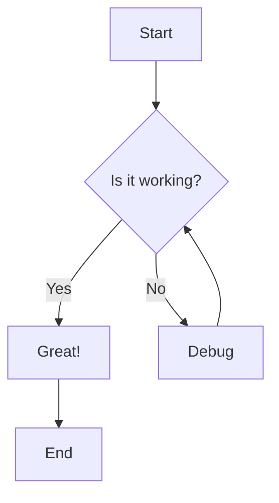

flowchart TD
    A[Admin] --> B{Choose action}

    B -->|Create| C[Enter product data]
    C --> D[(Database)]
    D -->|INSERT| E[Product created]

    B -->|Read| F[Request products]
    F --> D
    D -->|SELECT| G[Return products]

    B -->|Update| H[Edit product]
    H --> D
    D -->|UPDATE| I[Product updated]

    B -->|Delete| J[Delete product]
    J --> D
    D -->|DELETE| K[Product deleted]